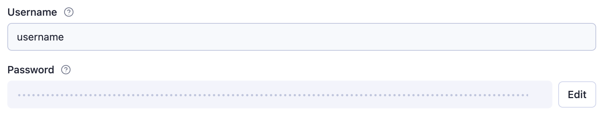

# Example secret input actor

This Apify actor showcases how to use secret fields in the actor input.

## Setting an input field as secret

To make an input field secret, just set `"isSecret": true` to the field in the actor's `INPUT_SCHEMA.json`, like this:

```jsonc
{
    // ...
    "properties": {
        // ...
        "password": {
            "title": "Password",
            "type": "string",
            "description": "A secret, encrypted input field",
            "editor": "textfield",
            "isSecret": true
        },
        // ...
    },
    // ...
}
```

The editor for this input field will then turn into a secret input, and when you edit the field value, it will be stored encrypted.


## Reading secret input fields

When you read the actor input through `Actor.getInput()`, the encrypted fields are automatically decrypted, without any additional code needed.

```js
> await Actor.getInput();
{
    username: 'username',
    password: 'password'
}
```

If you read the `INPUT` key from the actor run's default key-value store directly, you will still get the original, encrypted input value.

```js
> await Actor.getValue('INPUT');
{
    username: 'username',
    password: 'ENCRYPTED_VALUE:Hw/uqRMRNHmxXYYDJCyaQX6xcwUnVYQnH4fWIlKZL2Vhtq1rZmtoGXQSnhIXmF58+DjKlMZpTlK2zN3YUXk1ylzU6LfXyysOG/PISAfwm27FUgy3IfdgMyQggQ4MydLzdlzefX0mPRyixBviRcFhRTC+K7nK9lkATt3wJpj91YAZm104ZYkcd5KmsU2JX39vxN0A0lX53NjIenzs3wYPaPYLdjKIe+nqG9fHlL7kALyi7Htpy91ZgnQJ1s9saJRkKfWXvmLYIo5db69zU9dGCeJzUc0ca154O+KYYP7QTebJxqZNQsC8EH6sVMQU3W0qYKjuN8fUm1fRzyw/kKFacQ==:VfQd2ZbUt3S0RZ2ciywEWYVBbTTZOTiy'
}
```

## Further information

You can find out more about the secret input feature in the [secret input docs](https://docs.apify.com/actors/development/secret-input).
